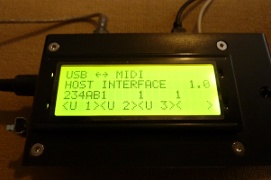

# MIDI Interface - Complete Project


This project is the result of modifying existing software in order to connect several midi devices together and to a computer without any artifacts.

It works on a Raspberry Pi Pico Board (also on a RP 2040 Zero and others) and did compile well with the Pico-SDK Version 1.51 and 2.00.

Thanks to Ha Thach, RPPICOMIDI, sekigon-gonnoc and many others who made this project possible.




## Main Features

This is an interface between a computer, up to 4 USB midi keaboards and up to 2 (old) 5-pin-keyboards (one as input only).

It is possible to route any midi message to any device or to several devices at the same time (depending on selected settings).

Several midi devices (and a computer) can send midi data to the same device without disturbing each other.

Midi clock and active sense messages can be supressed (and are by default).

Settings are not saved.

UART debug is disabled because both UART's are used for midi.


## Hardware
  - Raspberry Pi Pico Board (RP2040)
  - one optocoupler for each 'standard Midi' input (for example 6N 137)
  - a 4 x 20 display with HD44780 chip
  - a joystick switch or 5 buttons


## Used libraries
  - a modified version of RPPICOMIDI's usb_midi_host library
  - RPPICOMIDI's midi_uart_lib library
  - RPPICOMIDI's ring_buffer_lib library
  - a modified version of sekigon-gonnoc's Pico PIO USB
    - with lower processor load
    - using one state machine on each of both PIO blocks
    - with less synchronization (might lead to problems with bad lowspeed devices)
  - a modified version of the midi device library inside TinyUSB


## IMPORTANT Tweaks

Display RW Pin MUST be hardcoded to GND
  to prevent the display to output data which may destroy the pico because it gives out 5 V instead of 3.3 V.

Optocoupler 6N 137 gives out 5 V, it MUST be converted to 3,3 V (with 2 resistors for example)

USB data lines (dp und dm) must be connected to GND by a 15 k resistor

Content of lib directory "usb_midi_device" must be copied to .../tinyusb/src/class/midi

Pico PIO USB must have been activated (once) by
  "python3 tools/get_deps.py rp2040"
  (from inside the tinyusb directory)


## CONNECTIONS

```

  GPIO    Pin
  0       1       Display E
  1       2       UART0 RX only
  2-3     4-5     USB3
  4-5     6-7     UART1 TX + RX
  6-7     9-10    USB4
  8-15    11-20   Display data
  16-17   21-22   USB1
  18-22   24-29   Switches
  26-27   20-21   USB2
  28      34      Display RS
```


## Customize Settings

- adjust max. number of usb midi devices
  <br>in file lib/Pico-PIO-USB/src/pio_usb_configuration.h (default: #define PIO_USB_ROOT_PORT_CNT 4, less may reduce processor load)
- determine the USB dp pins
  <br>in file midi_interface.c (for example: #define PIO_USB1_DP_PIN 16)
- change the behavior after start
  <br>in file midi_interface.c (mode, m1_mode ... u4_mode, see below)


## Display Info
```
    RW hardcoded to GND (IMPORTANT !)
    data  -> GPIO 8-15  -> (0xFF00)
    rs    -> GPIO 28    -> (0x10000000)
    e     -> GPIO 6     -> (0x40)
    total               -> (0x1000FFC0)
```


## PIO-USB
```
    USB1 -> GPIO 16-17  -> (0x10000 + 0x20000)
    USB2 -> GPIO 26-27  -> (0x4000000 + 0x8000000)
    USB3 -> GPIO 2-3    -> (0x4 + 0x8)
    USB4 -> GPIO 6-7    -> (0x40 + 0x80)
```


## Switches:
```
    5 buttons are needed or a joystick (GPIO 18-22).
    "ON" means: connected to GND.
    left-right      -> 18-19  -> (0x40000 + 0x80000)
    up-down         -> 20-21  -> (0x100000 + 0x200000)
    click (center)  -> 22     -> (0x400000)
    total:                    -> (0x7C0000)
```


## SOFTWARE

### "mode" variable:
```
    mode & 0x07: 8 routing presets
    0x08    Cable Mode on/off
    0x10    Tic on/off
    0xE0:   (Switch Mode) 20:Channel 40:Voice 60:Bank 80:Effect A0:Misc C0: E0:
```


### routing variables (u=USB, m=midi, c=computer):
```
  u1_mode ... u4_mode, m1_mode, m2_mode, c_mode
        value     target
        0x01        U1
        0x02        U2
        0x04        U3
        0x08        U4
        0x10        M1
        0x20        C

  c_mode & 0xC0:
        0x40: detail settings U
        0x80: detail settings M / C
```


### variable "sw_flag":
```
    0x02: Key pressed
    0x00: Mode change
    0x10: Midi events
    0x20: Midi events 2. Level
```

